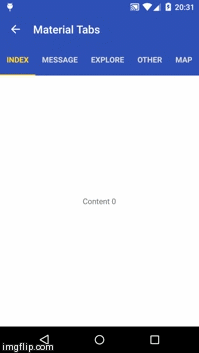

# Material_Tabs
### Material Toolbar with Tabs



# Usage

*For a working implementation of this project see the `app/` folder.*

  Include the following dependency to your gradle file.

```groovy
        compile 'com.android.support:appcompat-v7:22.0.0'
        compile 'com.android.support:support-v4:22.0.0'
        compile 'com.android.support:cardview-v7:21.0.3'
        compile 'com.jpardogo.materialtabstrip:library:1.0.9'
        compile 'com.jakewharton:butterknife:6.1.0'
```

  Include the PagerSlidingTabStrip widget in your layout. This should usually be placed
     above the `ViewPager` it represents.

            <com.astuetz.PagerSlidingTabStrip
                        android:id="@+id/slidingtabs"
                        android:layout_width="match_parent"
                        android:layout_height="?attr/actionBarSize"
                        android:background="?attr/colorPrimary"
                        app:pstsIndicatorColor="@color/floating_color"
                        app:pstsTextColorSelected="@color/floating_color"
                        android:textColor="#DDD"
                        android:fillViewport="false">
            </com.astuetz.PagerSlidingTabStrip>

  In your `onCreate` method (or `onCreateView` for a fragment), bind the
     widget to the `ViewPager`.


        ViewPager pager = (ViewPager) findViewById(R.id.viewpager);
        pager.setAdapter(new MyPagerAdapter(getSupportFragmentManager()));

        PagerSlidingTabStrip tabs = (PagerSlidingTabStrip) findViewById(R.id.slidingtabs);
        tabs.setViewPager(pager);

  If your adapter implements the interface `CustomTabProvider` you can past you custom tab view/s.
  In case the the view returned contains the id `R.id.psts_tab_title`, this view should be a `Textview`  and
  will be used to placed the title. If you don't want the library manage your TextView title for the tab,
  use a different id than `R.id.psts_tab_title` in your tab layout.

  If your adapter don't implements the interface `CustomTabProvider` the default tab will be use (That's a TextView with id `R.id.psts_tab_title`)

  *(Optional)* If you use an `OnPageChangeListener` with your view pager
     you should set it in the widget rather than on the pager directly.

         slidingtabs.setOnPageChangeListener(mPageChangeListener);

# Customization

From theme:

* `android:textColorPrimary` value (from your theme) will be applied automatically to the tab's text color (Selected tab with 255 alpha and non selected tabs with 150 alpha) , underlineColor, dividerColor and indicatorColor, if the values are not define on the xml layout.

Notes about some of the native attr:

* `android:textColor` Non selected tabs text color. If you DO define `textColor` It will be apply to **NON selected** tabs and **NO ALPHA** will be applied to them, **the colour you define is the one you will see**. If you want to define a half transparent color in `textColor`, you can pass #80FFFFFF (That's an example for half transparent white)
* `android:textSize` Tab text size
* `android:paddingLeft` or `android:paddingRight` layout padding. If you apply both, they should be balanced. PR #69 have a good explanation of this behaviour.

Custom attr:

 * `pstsIndicatorColor` Color of the sliding indicator. `textPrimaryColor` will be it's default color value.
 * `pstsUnderlineColor` Color of the full-width line on the bottom of the view. `textPrimaryColor` will be it's default color value.
 * `pstsUnderlineHeight` Height of the full-width line on the bottom of the view.
 * `pstsTextAlpha` Set the text alpha transparency for non selected tabs. Range 0..255. 150 is it's default value. It **WON'T** be use if `textColor` is defined in the layout. If `textColor` is **NOT** defined, It will be apply to the non selected tabs.
 * `pstsTextColorSelected` Set selected tab text color. `textPrimaryColor` will be it's default color value.
 * `pstsTextStyle` Set the text style, default bold.
 * `pstsTextSelectedStyle` Set the text style of the selected tab, default bold.
 * `pstsTextAllCaps` If true, all tab titles will be upper case, default true.
 * `pstsDividerColor` Color of the dividers between tabs. `textPrimaryColor` will be it's default color value.
 * `pstsDividerPadding` Top and bottom padding of the dividers.
 * `pstsDividerWidth` Stroke width of divider line, defaults to 0.
 * `pstsIndicatorHeight`Height of the sliding indicator.
 * `pstsTabPaddingLeftRight` Left and right padding of each tab.
 * `pstsScrollOffset` Scroll offset of the selected tab.
 * `pstsTabBackground` Background drawable of each tab, should be a StateListDrawable.
 * `pstsShouldExpand` If set to true, each tab is given the same weight, default false.
 * `pstsPaddingMiddle` If true, the tabs start at the middle of the view (Like Newsstand google app).


*Almost all attributes have their respective getters and setters to change them at runtime* , open an issue if you miss any.

# License

    Copyright 2013 Andreas Stuetz

    Licensed under the Apache License, Version 2.0 (the "License");
    you may not use this file except in compliance with the License.
    You may obtain a copy of the License at

       http://www.apache.org/licenses/LICENSE-2.0

    Unless required by applicable law or agreed to in writing, software
    distributed under the License is distributed on an "AS IS" BASIS,
    WITHOUT WARRANTIES OR CONDITIONS OF ANY KIND, either express or implied.
    See the License for the specific language governing permissions and
    limitations under the License.